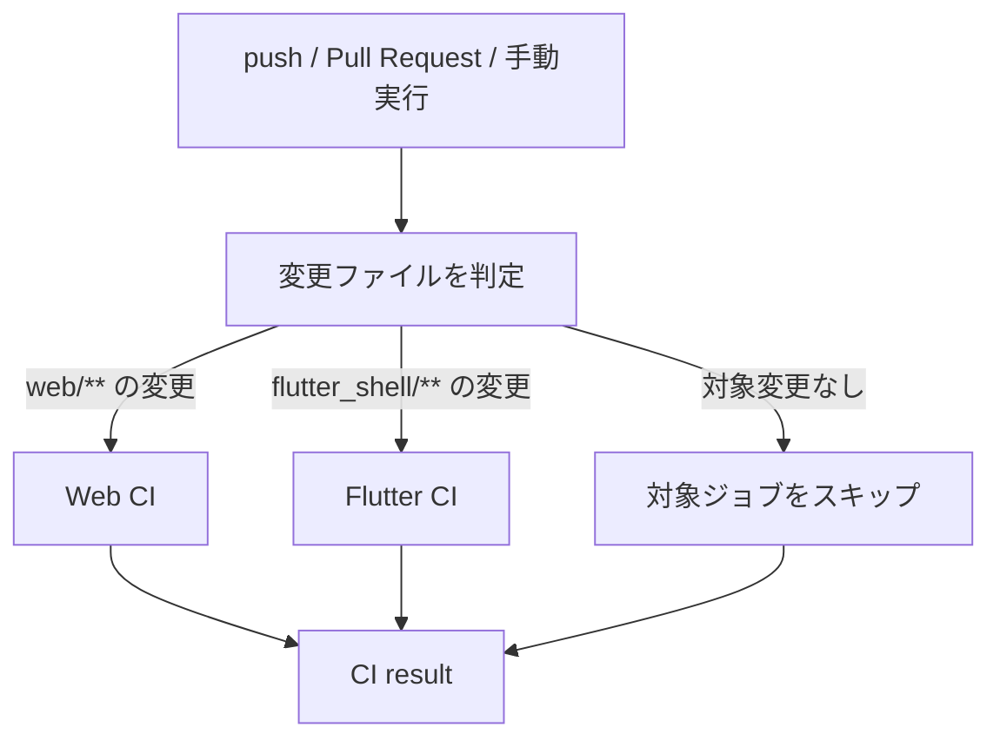

# CIワークフロー

Meal Roomでは、GitHub Actionsを利用してブランチへのpushおよびPull Requestの更新時に自動チェックを行います。

## 目的

- React（Web）とFlutterの変更を自動判定する
- 変更されたアプリケーションに必要なチェックだけを実行する
- ビルドエラー、型エラー、静的解析エラー、テスト失敗をマージ前に検出する
- 不要なジョブを省略し、GitHub Actionsの無料枠を効率的に利用する

## 対象ワークフロー

- ファイル: `.github/workflows/web-build.yml`
- 表示名: `Branch CI`

## 起動条件

次のタイミングで起動します。

1. 任意のブランチへのpush
2. Pull Requestの作成・更新
3. GitHub Actions画面からの手動実行

同じブランチで新しい実行が開始された場合、古い実行は自動的にキャンセルされます。

## 処理フロー

ワークフロー自体が変更された場合は、設定内容を検証するためWebとFlutterの両方を実行します。

## Web CI

対象パス:

- `web/**`
- `.github/workflows/web-build.yml`

実行内容:

1. Node.js 22をセットアップ
2. `npm ci`で依存関係を固定インストール
3. `npm test --if-present`でテストスクリプトが存在する場合のみテストを実行
4. `npm run build`でTypeScriptの型チェックとViteビルドを実行

`package-lock.json`を利用したnpmキャッシュを有効化しています。

## Flutter CI

対象パス:

- `flutter_shell/**`
- `.github/workflows/web-build.yml`

実行内容:

1. Flutter 3.24系のstable版をセットアップ
2. `flutter pub get`で依存関係を取得
3. `flutter analyze`で静的解析を実行
4. `flutter test`でテストを実行

Flutter SDKのキャッシュを有効化しています。

## CI resultジョブ

`CI result`は、変更対象によってWebまたはFlutterのジョブがスキップされた場合でも、ワークフロー全体の成否を一つの結果として扱うためのジョブです。

次の場合に失敗します。

- 変更判定ジョブが失敗した場合
- 実行対象になったWeb CIが失敗した場合
- 実行対象になったFlutter CIが失敗した場合

対象外としてスキップされたジョブは正常として扱います。ブランチ保護ルールでは、必要に応じて`CI result`をRequired status checkに指定してください。

## 無料枠を意識した設定

- 変更のないアプリケーションのジョブは起動しない
- Node.jsとFlutterの依存関係をキャッシュする
- 同じブランチの古い実行をキャンセルする
- Webは10分、Flutterは15分のタイムアウトを設定する
- Ubuntuランナーのみを利用する

## 今後の拡張

テストコードを追加した場合、既存のコマンドに含まれるテストは自動的にCIへ反映されます。Web側でテストフレームワークを導入する場合は、`web/package.json`に`test`スクリプトを追加してください。
